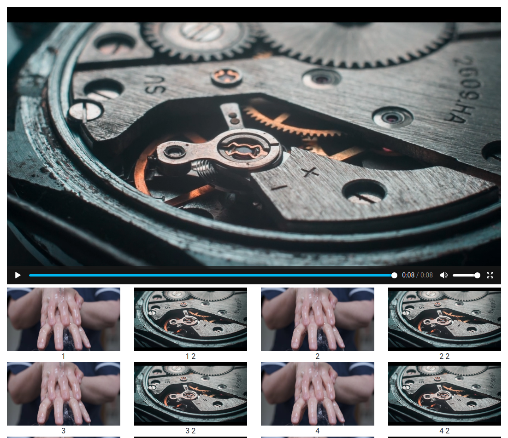

Node Video Player   
=================
NVP is a lightweight web-based video player built with React.js and Node.js with an emphasis on being easily usable by users with accessibility issues which make more complex UIs difficult to use.

Screenshot
----------

Installation
------------
1. Install [Node.js](https://nodejs.org/en/) and a package manager (I will be using [Yarn](https://yarnpkg.com/))
2. Clone NVP and enter the directory: `git clone https://github.com/RobTheFiveNine/node-video-player.git && cd node-video-player`
3. Install the dependencies: `yarn install`
4. Build the React.js application: `yarn build`
5. Edit `config.json` to set the port number you want to run NVP on and which directory the videos can be found in
6. Optionally, run the `__tools__/create_thumbnails.sh` script in the directory that contains the video files to automatically create thumbnails for the videos
7. Start NVP by running `yarn start`

Why is the UI so basic?
-----------------------
I developed this package for someone who suffers from a cognitive impairment that makes using [what most people consider] simple interfaces very challenging.

For example, prior to developing NVP, they would open their file manager, navigate to the videos directory, double click the video they'd like to watch, and then be presented with a media player. If they wanted to watch something else, they would then need to close the media player or find the other open window.

Although this example sounds like run of the mill multi-tasking on a computer, for people with cognitive impairments and certain learning difficulties, this non-linear approach with several things to remember can be very confusing.

The interface I found to work best for this person, was the one you see here in NVP - all the videos on one page, with large(ish) thumbnails that are easy to click, without the user ever needing to leave the one window.

Roadmap
-------
- Fix [The Bugs](https://github.com/RobTheFiveNine/node-video-player/issues)
- Flesh the `create_thumbnails.sh` tool out into something that can be executed without having to place it in the same directory as the video files, or possibly migrate it to JavaScript and incorporate it into the server itself
- Create a Docker image to make deployment easier

License
-------
This program is free software: you can redistribute it and/or modify it under the terms of the GNU General Public License as published by the Free Software Foundation, either version 3 of the License, or (at your option) any later version.

This program is distributed in the hope that it will be useful, but WITHOUT ANY WARRANTY; without even the implied warranty of MERCHANTABILITY or FITNESS FOR A PARTICULAR PURPOSE.  See the GNU General Public License for more details.

You should have received a copy of the GNU General Public License along with this program.  If not, see <https://www.gnu.org/licenses/>.

